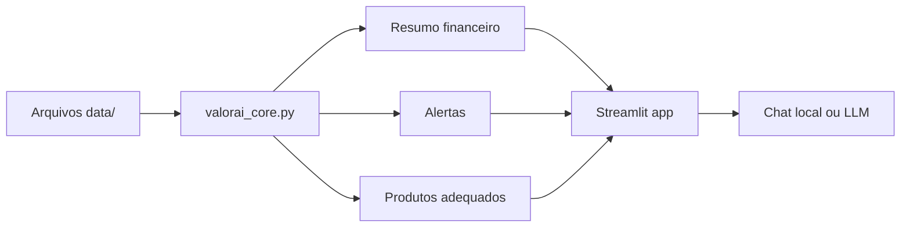

# ValorAI - Documentacao do Agente

## Caso de uso

ValorAI resolve o problema de pessoas que querem entender sua vida financeira sem depender de planilhas complexas. O agente analisa transacoes, historico de atendimento, perfil de investidor e produtos financeiros mockados para:

- resumir renda, despesas, saldo e taxa de investimento;
- detectar alertas de gastos e dividas;
- sugerir proximos passos de planejamento;
- indicar produtos mockados coerentes com perfil e objetivos.

## Persona e tom de voz

O ValorAI se comunica como um consultor financeiro educacional: claro, prudente, objetivo e acolhedor. Ele evita jargoes quando possivel e sempre separa fatos observados de sugestoes.

## Arquitetura

## Fluxo de dados

1. O app carrega arquivos CSV e JSON da pasta `data/`.
2. O modulo `valorai_core.py` calcula indicadores financeiros.
3. O app exibe metricas, graficos e respostas no chat.
4. Se `OPENAI_API_KEY` existir, o app chama o LLM com contexto restrito.
5. Se nao houver chave ou a chamada falhar, o motor local responde com regras deterministicas.

## Seguranca

- O agente usa apenas dados mockados incluidos no repositorio.
- O system prompt proibe inventar taxas, produtos, saldos ou eventos.
- A resposta deve explicitar quando faltam dados.
- O app inclui aviso de que nao substitui consultoria profissional.
- Produtos sao sugestoes educacionais, nao recomendacoes individualizadas.
